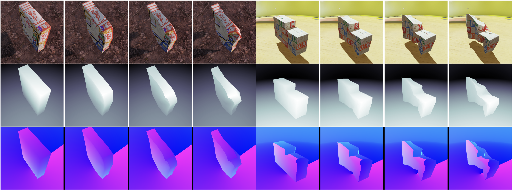
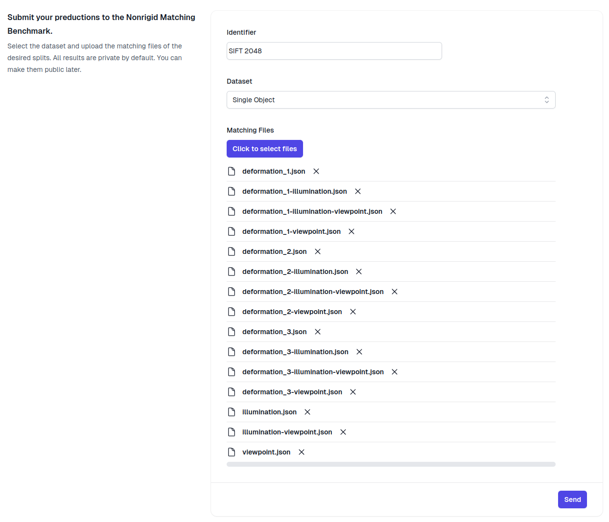

# Nonrigid Correspondence Benchmark



## Introduction

Welcome to the Nonrigid Correspondence Benchmark! Gathering real data for nonrigid visual correspondence is tough due to the time-consuming annotation process and the difficulty in controlling surface deformations. To simplify this, we've created a photorealistic simulated dataset for evaluating image correspondence methods in nonrigid scenes. Our dataset features realistic deformations on real scanned objects, ensuring both photorealism and semantic diversity. Unlike other datasets, ours provides accurate and dense multimodal ground truth annotations with full control over scenarios and object deformation. 

We provide three different datasets for evaluating the nonrigid correspondence problem under different situations.
- The Multiple Objects dataset contains multiple objects with different materials and shapes. 
- The Single Object dataset contains a single object with different scenarios. 
- The Scale dataset contains the same object with different scales to push the limits of the methods. All datasets contain RGB images, depth maps, normal maps, segmentation masks, and background masks.

If you want to train or finetune your method, you can download our training sets with over 2M pairs of images, just take a look at the [training data (Soon)](training_data/README.md) readme.

Also, if you want to generate even more data, or a more specilized one, you're in luck! We have made available the code to generate the data, but you will need to take a look at the this other readme file [here (Soon)](data_generation/README.md).

## Intructions for submitting results

If you want measure your methods performance on our benchmark, you can follow the general steps below:
  1. Download the desired test data (Multiple Objects, Single Object, or Scale) using the provided links. [[Download Data Section]](#download-data)
  2. Use the `selected_pairs.json` file to get the pairs of images to be used for evaluation. [[Data Structure Section]](#data-structure)
  3. Save the keypoints and matches in a `.json` file with the name of the split, like `scale_1.json`. [[Benchmark submission file formart Section]](#benchmark-submission-file-formart)
  4. Go to the evaluation webpage at [benchmark.eucadar.com](https://benchmark.eucadar.com) and submit your results. [[Submitting Results Section]](#submitting-results)

The whole process is very simple and we provide some utilities to help you evaluate your method. You can find them in the [Some tools to help you Section](#some-tools-to-help-you).

## Download Data

You can download the test data using the following commands:

```bash
# zip for Multiple Objects evaluation dataset 1.82GB
wget -O test_multiple_obj.zip 'https://onedrive.live.com/download?resid=C3FEA201A5BB0A9A%2165462&authkey=!AAgnTe6fVsT2PLI'

# zip for Single Object evaluation dataset 2.55GB
wget -O test_single_obj.zip 'https://onedrive.live.com/download?resid=C3FEA201A5BB0A9A%2165463&authkey=!ABBR6mHdMKB_0aQ'

# zip for Scale evaluation dataset 1.92GB
wget -O test_scale.zip  'https://onedrive.live.com/download?resid=C3FEA201A5BB0A9A%2165464&authkey=!AHh7E9BHGZeYYXc'

```


### Data Structure

The test data is what you will use to evaluate your method. We have made available three different datasets for evaluation: Multiple Objects, Single Object, and Scale.
They are organized in the following way:

``` bash
- test_single_obj.zip # Downloaded ZIP
    - test_single_obj/ 
        - selected_pairs.json # Pairs of images to be used for evaluation
        - test_sequence_000/ # Reference undeformed sequence
            - scenario_000/ # One of four scenarios
                - bgmask_00000.png # Background mask
                - depth_00000.tiff # Depth map 
                - normal_00000.png # Normal map
                - rgba_00000.png # RGB image
                - segmentation_00000.png # Segmentation of the objects
                - segmentation_00000_palette.png # Segmentation palette for visualization
            - scenario_001/ # Same objects, but with different rendering conditions
            - scenario_002/ # Same objects, but with different rendering conditions
            - scenario_003/ # Same objects, but with different rendering conditions
        - test_sequence_000_deformed_timestep_0001/ # Deformed version of the reference sequence
        - test_sequence_000_deformed_timestep_0002/ # Deformed version of the reference sequence
        - test_sequence_000_deformed_timestep_0003/ # Deformed version of the reference sequence
```
In the exemple above, `test_sequence_000` is the reference sequence and `test_sequence_000_deformed_timestep_0001` is the deformed version of the reference sequence. 
The `selected_pairs.json` file contains the pairs of images that should be used for evaluation. 

The selected pairs file follows the following format:
```json5
{
  "scale_1": [ // This is a split
    [
      "test_sequence_024/scenario_003/rgba_00000.png", // This is a pair
      "test_sequence_024/scenario_002/rgba_00000.png"
    ],
    [
      "test_sequence_024/scenario_003/rgba_00000.png", // This is a pair
      "test_sequence_024/scenario_004/rgba_00000.png"
    ],
    [
      "test_sequence_024/scenario_002/rgba_00000.png", // This is a pair
      "test_sequence_024/scenario_001/rgba_00000.png"
    ],
  ],
  // more splits ...
}
```

When saving the results, the split name should be the name of your file.

## Benchmark submission file formart

Evaluation is easy! You can use the `select_pairs.json` file to get the pairs of images, and just save the keypoints and matches in a `.json` file.

The output file should have the name of the split, like `scale_1.json`, and the format is a list of dictionaries with the keys `keypoints1`, `keypoints2`, and `matches`. They should be in the same order as the pairs in the `selected_pairs.json` file.

```yaml
[
  {
    "keypoints1": [[x1, y1], [x2, y2], ...], // List of keypoints
    "keypoints2": [[x1, y1], [x2, y2], ...], // List of keypoints
    "matches": [[0, 1], [1, 2], ...] // List of matches indexes
  },
  // more dictionaries ...
]
```

We have provided a some utilities to help you evaluate your method. Like this eval loop:

```python
def eval_loop(benchmark_path, predictions_path, match_fn, datasets = ['test_single_obj', 'test_multiple_obj', 'test_scale']):
    
    for dataset_type in datasets:
        selected_pairs = load_benchmark(os.path.join(benchmark_path, dataset_type))
        os.makedirs(os.path.join(predictions_path, dataset_type), exist_ok=True)
        
        for s_idx, split in enumerate(selected_pairs.keys()):
            json_file = os.path.join(predictions_path,dataset_type, f'{split}.json')
            
            predictions = []
            for pair_idx, pair in enumerate(tqdm(selected_pairs[split])):
                sample1 = load_sample(pair[0])
                sample2 = load_sample(pair[1])

                # ============================ #
                # Run your method here !!!!
                keypoints1, keypoints2, matches = match_fn(sample1, sample2)
                # ============================ #
                
                predictions.append({
                    'keypoints1': keypoints1,
                    'keypoints2': keypoints2,
                    'matches': matches,
                })
                
            
            with open(json_file, 'w') as f:
                json.dump(predictions, f)
```

If you want to cache your detection and descriptors, take a look at the [`eval_loop_cached`](src/nonrigid_benchmark/utils.py#L91).

With your results saved, you can now go to the evaluation webpage at [benchmark.eucadar.com](https://benchmark.eucadar.com) and submit your results.

## Submitting Results

To submit and manage your results you need to create an account at [benchmark.eucadar.com](https://benchmark.eucadar.com). We only provide github login at the moment, but don't worry, we don't collect any data from your account other the email, username, and profile picture. The website code is also open-source and you can check it in full in the [eucadar/nonrigid-benchmark-website](https://github.com/felipecadar/nonrigid-benchmark-website).

After logging in, the submission page will be available. You can submit your results by uploading the `.json` files generated in the previous step. All submissions are private by default, but you can make them public afterwards if you want to share your results with the community and be present at the [Leaderboard](https://benchmark.eucadar.com/leaderboard).

Here is a screenshot of the submission page:



## Some tools to help you

You dont actually need to install the package to submit results to the benchmark. Nevertheless, you can install the package to use some of the provided utilities like evaluation code and baseline methods.

To install the package locally, clone and then run the following command in the root directory of the repository:

```bash
git clone https://github.com/verlab/nonrigid-benchmark.git
cd nonrigid-benchmark

# maybe create your conda env here
conda create -n nrbench python=3.9
conda activate nrbench

pip install .
```


